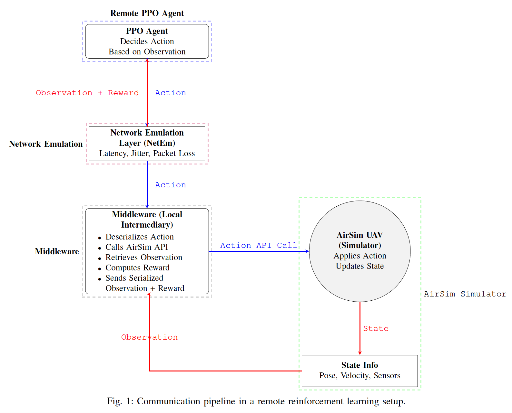

# AirSim Drone Network Simulation

   


# <span style="font-family: 'Arial Black', sans-serif; color: #0078D7;">Welcome to AeroLinkSim! 🚁</span>

> <span style="font-style: italic; font-size: 18px; color: #444444;">"Where innovation takes flight—simulating the skies, one link at a time."</span>

---

## <span style="color: #009688;">What is AeroLinkSim?</span>

AeroLinkSim is a cutting-edge simulation environment powered by AirSim, designed to push the boundaries of drone autonomy, connectivity, and real-world network challenges. From latency to packet loss, AeroLinkSim ensures every simulation feels as real as the sky above. 🌐✈️

---


## Table of Contents
- [Project Overview](#project-overview)
- [Introduction](#introduction)
- [Prerequisites](#prerequisites)
- [Architecture](#architecture)
- [Installation Guide](#installation-guide)
  - [Setting Up the Environment](#setting-up-the-environment)
  - [Dependencies](#dependencies)
  - [AirSim Setup](#airsim-setup)
  - [ZeroMQ Setup](#zeromq-setup)
- [Usage Instructions](#usage-instructions)
  - [Configuration Options](#configuration-options)
- [Project Demo](#project-demo)
- [Performance Metrics](#performance-metrics)
- [Project Goals](#project-goals)
- [Roadmap](#roadmap)
- [FAQs](#faqs)
- [Contributing](#contributing)
- [License](#license)
- [Acknowledgments](#acknowledgments)

## Project Overview

This simulation environment models a drone's behavior while interacting with a control system over a network connection.
The environment uses **ZeroMQ** for communication, **AirSim** for drone simulation, and applies various network conditions to simulate real-world delays and interruptions.
This project integrates AirSim with a dynamic network simulation framework designed for drone-based applications. The simulation models real-world network conditions such as latency, jitter, and packet loss, which are essential for testing drone performance in complex environments. In addition, it features ZeroMQ integration to enable efficient message exchange between drones and control systems, ensuring real-time communications.


## Environment Design

The environment is implemented in a Python class that encapsulates the drone's behavior, the interaction with its controller, and the network simulation. The core of the environment is based on the **OpenAI Gym** interface, supporting functions like `reset`, `step`, and reward calculation.


## Introduction
### What is AirSim?
AirSim is an open-source simulator developed by Microsoft for testing autonomous systems. It offers a realistic simulation environment for a variety of applications, such as drone flight, computer vision, and machine learning.

### What does this project do?
This project combines AirSim with network simulation tools to test the behavior of drones under various network conditions. It integrates with ZeroMQ for message handling and uses dynamic network parameters (latency, jitter, packet loss) to simulate real-world communication challenges.

### Key Features:
- **Dynamic Network Simulation**: Simulate latency, jitter, and packet loss to model real-world network conditions.
- **ZeroMQ Integration**: Enables reliable message exchange between drones and control systems.
- **Customizable Environments**: Adjust simulation parameters to mimic different drone scenarios.

The goal of this project is to provide an end-to-end simulation environment where drone performance can be tested under controlled network conditions before deployment in real-world scenarios.

## Prerequisites
###   System Requirements
| Requirement             | Version          |
|-------------------------|------------------|
| Operating System        | Linux (Ubuntu)   |
| AirSim                  | 1.8.1            |
| Python                  | 3.10 or later    |
| Conda                   | Latest           |

### Conda Setup
1. Initialize Conda:
   ```bash
   CONDA_BASE=$(conda info --base)
   source $CONDA_BASE/etc/profile.d/conda.sh
   ```
2. Create and activate a new Conda environment for the project:
   ```bash
   conda create -n airsim python=3.10
   conda init
   conda activate airsim
   ```
3. Install necessary Python libraries:
   ```bash
   pip install numpy msgpack-rpc-python airsim torch pillow tensorboard
   ```

### Additional Tools
| Tool     | Description                                             |
|----------|---------------------------------------------------------|
| ZeroMQ   | Messaging library for scalable, distributed systems.    |
| AirSimNH | AirSim’s custom version tailored for network simulation.|


## 🧠 Architecture

The **AirSim-based simulation pipeline** provides a structured framework for training UAVs using Reinforcement Learning (RL) under **dynamically varying network conditions**.

At the core of this framework is the **Proximal Policy Optimization (PPO)** agent, which acts as the decision-making module—mapping **sensory observations** to **control actions** in a **continuous action space**.

The agent interacts with the **AirSim environment**, a high-fidelity, physics-based simulator that models UAV dynamics, aerodynamics, and environmental disturbances. The simulated drone executes control commands—**pitch**, **roll**, **yaw**, and **throttle**—which directly influence its flight trajectory.

The environment then returns updated **state information**, including:
- UAV position  
- Velocity  
- Sensor data  

These observations form the basis for continuous policy learning.

---

### 🌐 Network Emulation

An extension of this pipeline introduces **network impairments** that mimic real-world conditions using **NetEm (Network Emulator)**. The following variations are simulated:
- Latency  
- Jitter  
- Packet loss  
- Bandwidth constraints  

These network-induced disruptions impact **real-time decision-making**, testing the agent's ability to operate under **impaired and fluctuating connectivity**.

A dedicated **reward calculation module** quantifies performance based on:
- Navigation efficiency  
- Policy robustness  
- Compliance with safety constraints  

This integrated **AirSim + PPO + NetEm** pipeline offers valuable insight into **RL-based flight control** within **decentralized**, **resource-constrained** environments.

---

### 🖼️ Diagram



> **Figure**: Communication pipeline in a Remote Reinforcement Learning (RRL) setup.  
> Actions are sent from a PPO agent through a network emulation layer to the middleware, which interfaces with the AirSim UAV simulator.  
> Observations and rewards flow back through the system to update the agent.

---


## Installation Guide
### Setting Up the Environment
1. Install Conda (if not installed):
   Follow the instructions on Anaconda's website to install Conda.

2. Create and activate the Conda environment:
   ```bash
   conda create -n airsim python=3.10
   conda activate airsim
   ```

### Dependencies
Install the required dependencies:
```bash
pip install numpy msgpack-rpc-python airsim torch pillow tensorboard
```

### AirSim Setup
1. Download AirSim:
   ```bash
   wget https://github.com/microsoft/AirSim/releases/download/v1.8.1/AirSimNH.zip
   ```
2. Extract AirSim:
   ```bash
   unzip ./AirSimNH.zip
   rm -f AirSimNH.zip
   ```
3. Configure AirSim script:
   ```bash
   sed '5s/$/ -graphicsadapter=1/' ./AirSimNH/LinuxNoEditor/AirSimNH.sh > file.tmp
   chmod 740 file.tmp
   mv file.tmp ./AirSimNH/LinuxNoEditor/AirSimNH.sh
   ```
4. Run AirSim:
   ```bash
   ./AirSimNH/LinuxNoEditor/AirSimNH.sh
   ```


## Project Goals
- Create a realistic testing environment for drones.
- Facilitate research in network-aware autonomous systems.
- Provide a foundation for real-world deployment scenarios.

## Roadmap
- [x] Integrate AirSim and ZeroMQ.
- [x] Dynamic network simulation.
- [ ] Add support for multi-drone simulations.
- [ ] Implement advanced PPO training workflows.
- [ ] Enhance visualization of performance metrics.


## 🤝 Contributing
We welcome contributions to improve and extend this project. Here are some ways you can contribute:

- Report bugs or issues.
- Submit pull requests for bug fixes or new features.
- Suggest improvements to the documentation.

Please ensure that all contributions follow the project's coding standards and include adequate tests for new features.

## 📄 License

Copyright (c) [2025] [Stephen ODERO]

Permission is hereby granted, free of charge, to any person obtaining a copy
of this software and associated documentation files (the "Software"), to deal
in the Software without restriction, including without limitation the rights
to use, copy, modify, merge, publish, distribute, sublicense, and/or sell
copies of the Software, and to permit persons to whom the Software is
furnished to do so, subject to the following conditions:

The above copyright notice and this permission notice shall be included in all
copies or substantial portions of the Software.

THE SOFTWARE IS PROVIDED "AS IS", WITHOUT WARRANTY OF ANY KIND, EXPRESS OR
IMPLIED, INCLUDING BUT NOT LIMITED TO THE WARRANTIES OF MERCHANTABILITY,
FITNESS FOR A PARTICULAR PURPOSE AND NONINFRINGEMENT. IN NO EVENT SHALL THE
AUTHORS OR COPYRIGHT HOLDERS BE LIABLE FOR ANY CLAIM, DAMAGES OR OTHER
LIABILITY, WHETHER IN AN ACTION OF CONTRACT, TORT OR OTHERWISE, ARISING FROM,
OUT OF OR IN CONNECTION WITH THE SOFTWARE OR THE USE OR OTHER DEALINGS IN THE
SOFTWARE.


## Acknowledgments
- **AirSim**: Thanks to Microsoft for providing an excellent open-source drone simulation environment.
- **ZeroMQ**: A powerful messaging system that helped build the communication backbone for this project.
- **Contributors**: Thanks to everyone who contributed to making this project a success.


---

## 📄 License

**MIT License**
Copyright © 2025 **Stephen ODERO**

---

Permission is hereby granted, free of charge, to any person obtaining a copy
of this software and associated documentation files (the “Software”), to deal
in the Software without restriction, including without limitation the rights to:

- Use
- Copy
- Modify
- Merge
- Publish
- Distribute
- Sublicense
- Sell copies of the Software

and to permit persons to whom the Software is furnished to do so, subject to the following conditions:

> ⚠️ **Note:** The above copyright notice and
> this permission notice shall be included in all copies or substantial portions of the Software.

---

**Disclaimer:**
> THE SOFTWARE IS PROVIDED “AS IS”, WITHOUT WARRANTY OF ANY KIND,
> EXPRESS OR IMPLIED, INCLUDING BUT NOT LIMITED TO THE WARRANTIES OF
> MERCHANTABILITY, FITNESS FOR A PARTICULAR PURPOSE AND NONINFRINGEMENT.
> IN NO EVENT SHALL THE AUTHORS OR COPYRIGHT HOLDERS BE LIABLE FOR ANY CLAIM,
> DAMAGES OR OTHER LIABILITY, WHETHER IN AN ACTION OF CONTRACT, TORT OR OTHERWISE,
> ARISING FROM, OUT OF OR IN CONNECTION WITH THE SOFTWARE OR THE USE OR OTHER DEALINGS IN THE SOFTWARE.

---

